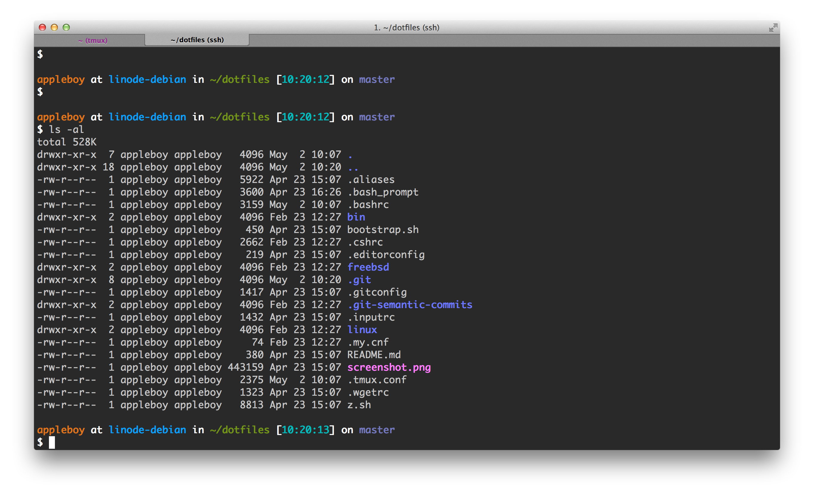
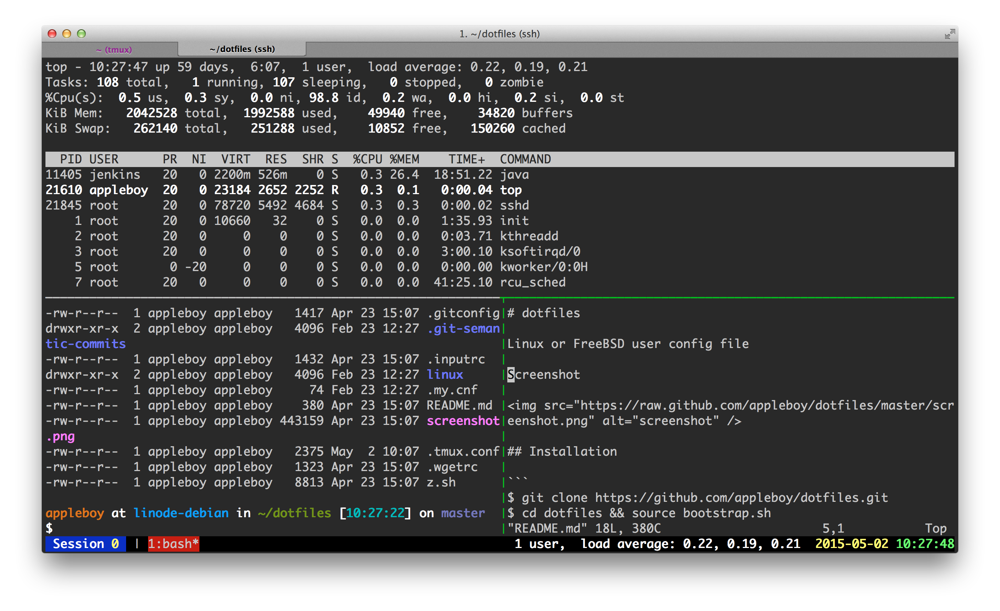

# dotfiles

Linux or FreeBSD user config file

Screenshot for bash



Screenshot for tmux



## Usage

```
$ git clone https://github.com/joeyghb/dotfiles.git && cd dotfiles && source bootstrap.sh
```

Install [spf13-vim](https://github.com/spf13/spf13-vim)

```
$ sh <(curl https://j.mp/spf13-vim3 -L)
```

## Tools

* [x] [z.sh](https://github.com/rupa/z)
* [x] [diff-so-fancy](https://github.com/stevemao/diff-so-fancy)
* [x] [git-blame-someone-else](https://github.com/jayphelps/git-blame-someone-else)
* [x] git-mv-with-history
* [x] [git-recent](https://github.com/paulirish/git-recent)
* [x] [git-open](https://github.com/paulirish/git-open)
* [x] [git-standup](https://github.com/kamranahmedse/git-standup)
* [x] [git-quick-stats](https://github.com/arzzen/git-quick-stats)
* [x] [git-recall](https://github.com/Fakerr/git-recall)
* [x] [wifi-password](https://github.com/rauchg/wifi-password) macOS only

## Demo

Download demo terminal from docker.

```
$ docker pull joeychu/docker-terminal
```

Login to docker terminal

```
$ docker run -ti joeychu/docker-terminal
```

# Author

Pgluffy 
